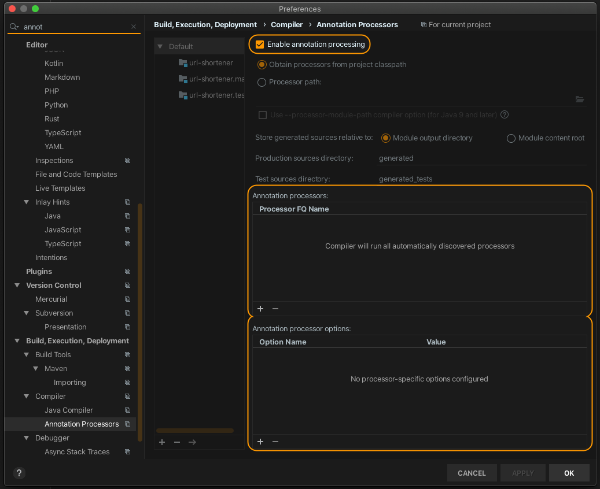

# MetricsProcessor
An annotation processor to make Prometheus metrics easier to use in Java.

# How to use
Under the plugins section add kapt:
```
id "org.jetbrains.kotlin.kapt" version "${YourKotlinVersionHere}"
```

In the dependencies Section
```
    implementation 'com.doordash_oss.metricsprocessor:processor:2.0.0'
    kapt "com.doordash_oss.metricsprocessor:processor:2.0.0"
```

and outside the dependency block (basically anywhere not in any other block) add the following lines as well to help your ide:
```
sourceSets {
    main {
        java {
            srcDir "${buildDir.absolutePath}/generated/source/kaptKotlin/"
        }
    }
}
```

If you use a linter, ktlint for example, and run into an issue with ktlint complaining about the generated files add the following lines to your build.gradle:
```
ktlint {
    filter {
        exclude { element -> element.file.path.contains("generated/") }
    }
}
```

You may also want to enable annotation processing in Intellij:


See [Sample.kt](sample/src/main/kotlin/com/doordash_oss/metricsprocessor/Sample.kt) for an example of how to use it.
